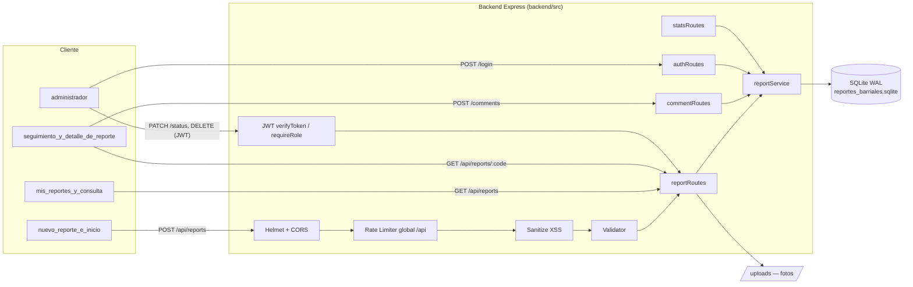
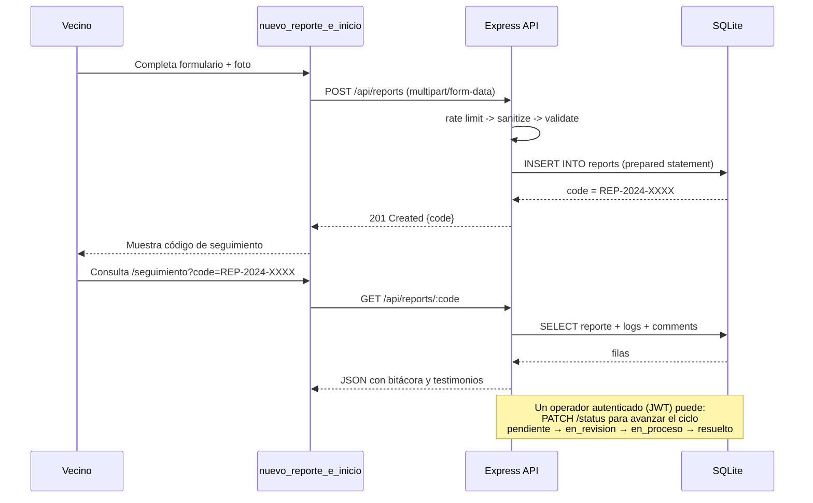

# Arquitectura del Sistema

## Vista general (Full-Stack)

## Flujo de un reporte (caso de uso principal)

## Justificación de decisiones de diseño (para la defensa técnica)

| Decisión | Por qué |
|---|---|
| SQLite con WAL + `foreign_keys=ON` | Cero infraestructura extra para desarrollo/demo, concurrencia razonable, y toda la integridad referencial de un RDBMS real. Migrable a PostgreSQL cambiando solo `src/config/database.js`. |
| Sentencias preparadas en el 100% de las queries | Elimina inyección SQL por diseño (no por sanitización posterior). |
| JWT con expiración de 8h + roles (`admin`, `operador`, `tecnico`) | El ciudadano no necesita cuenta (reporta anónimamente); solo el personal municipal se autentica para cambiar estados. |
| Middleware de sanitización + Helmet (CSP) | Defensa en profundidad contra XSS, además de la sanitización de inputs. |
| Rate limiting por endpoint (créación, comentarios, login, global) | Evita spam de reportes falsos y fuerza bruta sobre login, sin bloquear el uso legítimo. |
| Enmascaramiento de DNI/contacto en listados públicos | Cumplimiento de la Ley 25.326 de Hábeas Data: el dato identificatorio solo se revela a personal autenticado. |
| Carpeta `uploads/` con `X-Content-Type-Options: nosniff` y nombre de archivo aleatorio (UUID) | Evita path traversal y ejecución de scripts subidos como "imagen". |
