# Diagrama Entidad-Relación (DER)

Generado a partir del esquema real en `backend/src/database/schema.sql`.

```mermaid
erDiagram
    USERS ||--o{ AUDIT_LOGS : "genera (user_id)"
    REPORTS ||--o{ REPORT_LOGS : "tiene"
    REPORTS ||--o{ COMMENTS : "recibe"

    USERS {
        int id PK
        string username UK
        string password_hash
        string full_name
        string role "admin|operador|tecnico"
        string area
        datetime created_at
        int is_active
    }

    REPORTS {
        int id PK
        string code UK "REP-YYYY-XXXX"
        string nombre_apellido
        string dni
        string contacto
        string tipo_incidente "CHECK enum"
        string direccion
        string coordenadas
        string comuna
        text descripcion
        string foto_url
        string estado "CHECK enum"
        string prioridad "CHECK enum"
        string cuadrilla_asignada
        string tiempo_estimado
        string acta_numero
        datetime created_at
        datetime updated_at
    }

    REPORT_LOGS {
        int id PK
        int report_id FK
        string etapa
        string etiqueta_estado
        text descripcion
        string responsable
        datetime created_at
    }

    COMMENTS {
        int id PK
        int report_id FK
        string autor
        int es_iniciador
        string contenido
        datetime created_at
    }

    AUDIT_LOGS {
        int id PK
        string entity_type
        int entity_id
        string action
        int user_id FK
        string ip_address
        text user_agent
        text details
        datetime created_at
    }
```

## Notas de integridad referencial
- `report_logs.report_id` y `comments.report_id` → `reports.id` con `ON DELETE CASCADE` (al borrar un reporte se borra su bitácora y testimonios).
- `PRAGMA foreign_keys = ON` y `PRAGMA journal_mode = WAL` activos (ver `src/config/database.js`).
- Restricciones `CHECK` en `role`, `tipo_incidente`, `estado` y `prioridad` reemplazan tablas de catálogo, priorizando simplicidad para SQLite.
- Índices sobre `code`, `dni`, `estado`, `tipo_incidente` y `created_at` para las búsquedas y filtros del listado (`GET /api/reports`).
